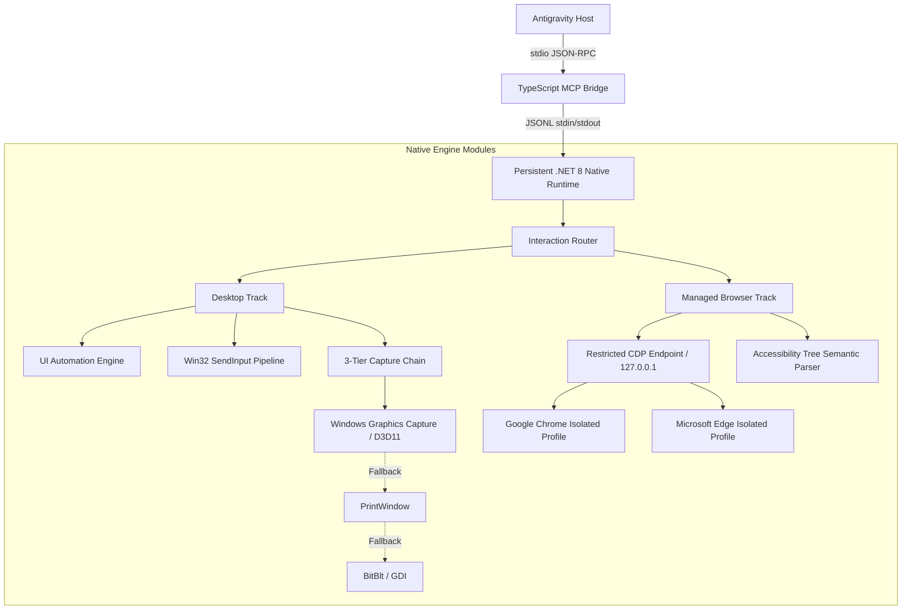

# Computer Use for Antigravity

**English** · [繁體中文](README.zh-TW.md)

<p align="left">
  <a href="https://github.com/scyx2611/computer-use-for-antigravity/releases/tag/v0.4.0"></a>
  
  
  
  <a href="LICENSE"></a>
</p>

Windows-only high-reliability native computer-use runtime designed for **Antigravity**.

The user-facing product name is **Computer Use for Antigravity**. The plugin identifier is `computer-use-for-antigravity`, while the MCP server key remains `computer-use` for full backwards compatibility.

Computer Use for Antigravity moves fragile desktop and browser interactions away from blind coordinate guessing into a **deterministic, verifiable, and bounded native runtime**. Instead of inferring clicks from pixels, models interact via semantic accessibility nodes, deterministic postconditions, bounded drift recovery, and hardware-accelerated screen capture.

---

## Architecture Overview



---

## Core Design Pillars

| Pillar | Description |
| :--- | :--- |
| 🎯 **Zero-Guess Determinism** | Semantic targeting via Accessibility Tree & UI Automation (`role`, `name`, `test_id`). Multiple matching candidates fail closed immediately with `AMBIGUOUS_TARGET` to prevent erroneous clicks. |
| 🛡️ **Managed Ephemeral Sandbox** | Launches Chrome or Edge in private ephemeral profiles with dedicated local loopback CDP endpoints. Enforces a strict CDP command allowlist—never exposing arbitrary JS evaluation, cookies, or default browser profiles. |
| ⚡ **Hardware-Accelerated Capture** | Uses Windows Graphics Capture (WGC / Direct3D 11) as the primary screenshot backend with seamless fallback to `PrintWindow` and `BitBlt`, reporting transparent diagnostics per backend. |
| 🔄 **Bounded Drift Recovery** | `computer_perform` executes multi-step action sequences with atomic postconditions. It automatically handles page drift, DOM re-rendering, and stale states with bounded retries (up to 5 attempts). |

---

## Comparison Matrix

| Capability Dimension | Traditional Vision-based Computer Use | Computer Use for Antigravity (v0.4.0) |
| :--- | :--- | :--- |
| **Targeting** | Guesses pixel coordinates (X, Y) from images | **Semantic node resolution** (`role`, `name`, `test_id`) + coordinate abstractions |
| **Ambiguity Handling** | Blindly picks the first candidate or halluncinates | **Fails closed** with `AMBIGUOUS_TARGET` and score breakdown |
| **DPI / Scaling** | High failure rate across varied display scaling | **DPI-aware** with Screen, Window, and Normalized (0~1) coordinate spaces |
| **Browser Interaction** | Synthetic mouse/keyboard simulations over browser chrome | **Native restricted CDP command pipeline** with instant text insertion & navigation |
| **Browser Security** | Potential leakage of personal cookies, session data & tabs | **Ephemeral sandbox profiles**; fully cleaned up after session teardown |
| **Verification** | Additional subjective visual inspection by LLM | **Deterministic postconditions** (URL, Title, Elements, Text, Page Stability) |
| **Recovery Strategy** | Blind retry loops or conversation reset | **Automated re-observe & re-resolve** loop with bounded retry limits |

---

## Quick Start

### Prerequisites
- **Operating System**: Windows 10 or 11 (x64)
- **Toolchain**: .NET 8 SDK (with Windows Desktop Runtime) and Node.js 20+

### 1. Build and Compile
From the repository root in PowerShell:

```powershell
# Build and publish native runtime
dotnet build native/ComputerUse.Native.csproj -c Release
dotnet publish native/ComputerUse.Native.csproj -c Release -r win-x64 --self-contained false -o dist/native

# Run native test suite
dotnet run --project tests/ComputerUse.Native.Tests/ComputerUse.Native.Tests.csproj -c Release --no-build

# Build TypeScript MCP Bridge
Push-Location mcp
npm ci
npm run typecheck
npm run build
Pop-Location
```

### 2. Global Installation
Install the plugin and register the MCP server for the current Windows user:

```powershell
.\install.ps1
```
> The installer copies the plugin assets to `%USERPROFILE%/.gemini/config/plugins/computer-use-for-antigravity/` and registers the server paths. Restart Antigravity after installation.

### 3. Verification & Smoke Tests
```powershell
# Desktop WGC capture and Notepad test
.\scripts\smoke-test.ps1

# Managed Chrome and Edge browser workflow tests
.\scripts\browser-workflow-test.ps1 -Browser chrome
.\scripts\browser-workflow-test.ps1 -Browser edge
```

---

## MCP Tool Reference

This plugin exposes 6 standardized MCP tools to Antigravity:

| Tool Name | Responsibility | Key Parameters |
| :--- | :--- | :--- |
| `computer_launch` | Launch applications or managed browser sessions | `path`: Executable path<br>`browser`: `{ mode: "managed", profile: "ephemeral" }`<br>`args`: Launch arguments |
| `computer_observe` | Observe UI state and capture screenshots | `window_id`: Target window ID<br>`include_screenshot`: Whether to return base64 PNG data |
| `computer_perform` | **Primary**: Multi-step action execution, verification & retry | `window_id`: Target window ID<br>`actions`: Array of action definitions with `expect` & `retry`<br>`verify`: Enable postcondition verification |
| `computer_act` | Execute a single low-level action bound to a state signature | `window_id`: Target window ID<br>`state_id`: Token from latest observation<br>`action`: Action definition |
| `computer_wait_for` | Wait for a window to appear and become interactive | `title_contains`: Title substring<br>`timeout_ms`: Bounded timeout in milliseconds |
| `computer_list_windows` | Enumerate visible top-level desktop windows | None |

---

## Workflows and Postconditions

In `computer_perform`, multi-step workflows can verify execution state deterministically:

```json
{
  "window_id": "browser-window-id",
  "actions": [
    {
      "type": "set_value",
      "target": { "test_id": "email-input" },
      "value": "developer@example.com",
      "expect": {
        "value_equals": {
          "target": { "test_id": "email-input" },
          "equals": "developer@example.com"
        }
      }
    },
    {
      "type": "click",
      "target": { "role": "button", "name": "Sign In" },
      "expect": {
        "url_contains": "/dashboard",
        "title_contains": "Dashboard",
        "element_exists": { "role": "heading", "name": "Welcome Back" },
        "page_stable": true,
        "navigation_complete": true
      },
      "retry": { "max_attempts": 3, "delay_ms": 100 }
    }
  ],
  "verify": true
}
```

### Supported Postcondition Keys
- **Element State**: `element_exists`, `element_absent`, `element_enabled`, `element_disabled`
- **Value & Text**: `value_equals`, `text_equals`, `text_contains`
- **Page & Navigation**: `url_equals`, `url_contains`, `title_contains`, `navigation_complete`
- **Visual Stability**: `ui_changed`, `ui_stable`, `page_changed`, `page_stable` (evaluated across 3 quiet 100 ms samples)

---

## Error Codes and Safety Guardrails

The runtime strictly enforces fail-closed safety behaviors:

| Error Code | Trigger Condition | Mitigation & Recovery |
| :--- | :--- | :--- |
| `AMBIGUOUS_TARGET` | Multiple equally plausible elements match the selector | **Fails closed**. Returns candidate list with scores; requires caller refinement. |
| `STALE_BROWSER_STATE` | Navigation or DOM mutation invalidates existing node handles | `computer_act` rejects immediately; `computer_perform` re-observes and re-resolves automatically. |
| `POSTCONDITION_FAILED` | Expected postconditions not satisfied before retries exhaust | Aborts subsequent actions and returns structured `execution_trace` with attempt records. |
| `TARGET_ELEVATED` | Target process runs with elevated (Administrator) privileges | **Refuses execution**. The runtime intentionally never performs UAC bypass. |
| `UNSUPPORTED_URL_SCHEME` | Attempted navigation to dangerous schemes (e.g. `javascript:`) | **Blocked before dispatch**. Only `http:`, `https:`, and `about:blank` are permitted. |

---

## Coordinate Space Abstraction

| Space | Meaning | Use Case |
| :--- | :--- | :--- |
| `screen` | Absolute desktop pixels | System-level interaction, legacy `x`/`y` compatibility |
| `window` | Pixels relative to the observed window's top-left corner | Window-relative UI interactions |
| `normalized` | Proportional coordinates from `0.0` to `1.0` | Cross-resolution responsive interactions (e.g. `(0.5, 0.5)` for window center) |

---

## License

This project is licensed under the [MIT License](LICENSE).
