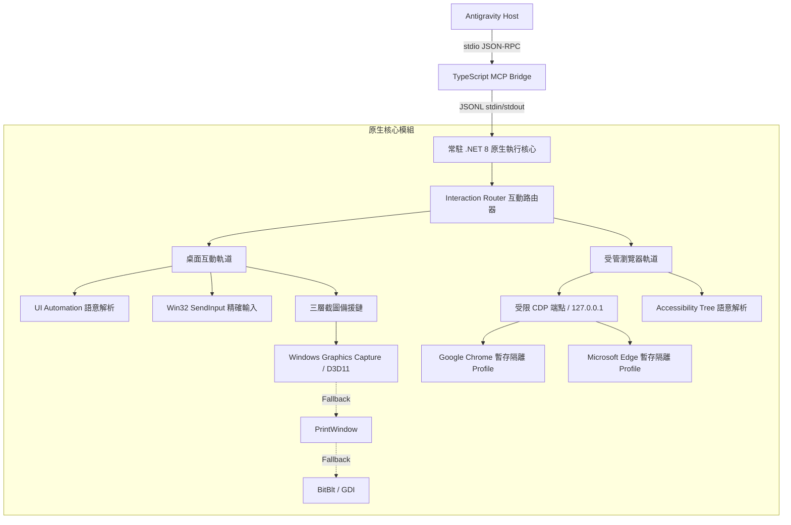

# Computer Use for Antigravity

[English](README.md) · **繁體中文**

<p align="left">
  <a href="https://github.com/scyx2611/computer-use-for-antigravity/releases/tag/v0.4.0"></a>
  
  
  
  <a href="LICENSE"></a>
</p>

專為 **Antigravity** 打造的 Windows 原生高可靠度 Computer Use 執行環境。

使用者看到的產品名稱是 **Computer Use for Antigravity**。插件識別碼為 `computer-use-for-antigravity`；MCP server key 維持 `computer-use` 以確保向下相容性。

Computer Use for Antigravity 的核心哲學是**「將模型介面保持精簡，把脆弱的桌面與瀏覽器互動交給確定性的原生執行環境」**。模型不再需要盲目猜測像素座標，而是透過語意結構節點、確定性後置條件驗證、自動狀態漂移重試以及硬體加速截圖，實現工業級的穩定自動化。

---

## 系統架構



---

## 核心設計原則

| 原則 | 說明 |
| :--- | :--- |
| 🎯 **零猜測確定性 (Zero-Guess Determinism)** | 優先透過 Accessibility Tree 與 UI Automation 節點進行語意綁定（`role`、`name`、`test_id`）。多重相同候選時嚴格回傳 `AMBIGUOUS_TARGET`，拒絕隨機或猜測點擊。 |
| 🛡️ **安全隔離受管沙箱 (Managed Ephemeral Sandbox)** | 支援 Chrome 與 Edge 受管啟動，自動配置專屬隔離 Profile 與本機 CDP 偵錯埠。受限指令白名單，絕不暴露任意 JS 執行、Cookie、儲存空間或使用者個人瀏覽器資料。 |
| ⚡ **硬體加速視覺備援鏈 (Hardware-Accelerated Capture)** | 以 Direct3D 11 支援的 Windows Graphics Capture (WGC) 作為主要截圖引擎，具備即時、高效能特徵；自動依序回退至 `PrintWindow` 與 `BitBlt`，並回傳完整診斷資料。 |
| 🔄 **有界漂移恢復與驗證 (Bounded Drift Recovery)** | `computer_perform` 支援多步行動與原子後置條件驗證（Postconditions）。若遇頁面刷新或 DOM 漂移，自動重新觀察與解析，提供最多 5 次有界重試。 |

---

## 方案對比矩陣

| 特性維度 | 傳統視覺型 Computer Use | Computer Use for Antigravity (v0.4.0) |
| :--- | :--- | :--- |
| **目標選取** | 依靠視覺大模型猜測像素座標 (X, Y) | **語意節點綁定** (`role`, `name`, `test_id`) + 絕對/相對/比例座標 |
| **多重匹配行為** | 隨機挑選或盲猜第一個候選 | **安全拒絕**，嚴格回傳 `AMBIGUOUS_TARGET` 與候選評分 |
| **螢幕縮放/解析度** | DPI 縮放容易導致座標偏移與點擊失效 | **DPI 感知** + 螢幕/視窗/歸一化 (0~1) 座標空間抽象 |
| **瀏覽器互動** | 純視覺畫面模擬鍵盤滑鼠 | **受管 CDP 原生通訊**，語意化填值、點擊、滾動與頁面導航 |
| **瀏覽器安全性** | 可能誤觸使用者個人憑證與歷史紀錄 | **暫存 Profile 隔離**，進程與暫存目錄用完即焚 |
| **結果驗證** | 再截一張圖交由視覺模型主觀推論 | **確定性後置條件驗證**（URL、標題、元素存在、文字相符、頁面穩定度） |
| **錯誤恢復** | 提示詞重新嘗試（盲目重新輸入） | **自動重新觀察與解析**，遇到 stale/drift 時有界恢復（上限 5 次） |

---

## 快速上手 (Quick Start)

### 系統需求
- **作業系統**：Windows 10 / 11 (x64)
- **開發環境**：.NET 8 SDK（含 Windows Desktop Runtime）與 Node.js 20+

### 1. 建置與編譯
在專案根目錄執行 PowerShell 指令：

```powershell
# 編譯並發布原生執行核心
dotnet build native/ComputerUse.Native.csproj -c Release
dotnet publish native/ComputerUse.Native.csproj -c Release -r win-x64 --self-contained false -o dist/native

# 執行原生單元測試
dotnet run --project tests/ComputerUse.Native.Tests/ComputerUse.Native.Tests.csproj -c Release --no-build

# 編譯 TypeScript MCP Bridge
Push-Location mcp
npm ci
npm run typecheck
npm run build
Pop-Location
```

### 2. 一鍵全域安裝
自動為當前 Windows 使用者安裝 plugin 與 MCP 設定：

```powershell
.\install.ps1
```
> 安裝腳本會將設定檔寫入 `%USERPROFILE%/.gemini/config/plugins/computer-use-for-antigravity/`，並自動註冊全域 MCP 伺服器路徑。安裝後請重啟 Antigravity。

### 3. 執行冒煙測試
```powershell
# 桌面 WGC 擷取與記事本測試
.\scripts\smoke-test.ps1

# 受管 Chrome 與 Edge 雙瀏覽器端到端工作流程測試
.\scripts\browser-workflow-test.ps1 -Browser chrome
.\scripts\browser-workflow-test.ps1 -Browser edge
```

---

## MCP 工具參考手冊

本專案向 Antigravity 暴露標準的 6 個 MCP 工具：

| 工具名稱 | 主要職責 | 重點參數 |
| :--- | :--- | :--- |
| `computer_launch` | 啟動應用程式或受管瀏覽器 | `path`: 執行檔路徑<br>`browser`: `{ mode: "managed", profile: "ephemeral" }`<br>`args`: 啟動參數 |
| `computer_observe` | 觀察視窗狀態並擷取螢幕畫面 | `window_id`: 目標視窗 ID<br>`include_screenshot`: 是否包含 base64 截圖 |
| `computer_perform` | **核心**：執行多步驟工作流程、驗證與有界重試 | `window_id`: 目標視窗 ID<br>`actions`: 動作清單（含 `expect` 與 `retry`）<br>`verify`: 啟用後置條件驗證 |
| `computer_act` | 執行單一低階操作（受嚴格 state_id 綁定） | `window_id`: 目標視窗 ID<br>`state_id`: 前次觀察的狀態簽章<br>`action`: 操作定義 |
| `computer_wait_for` | 等待視窗出現並確認可互動狀態 | `title_contains`: 視窗標題關鍵字<br>`timeout_ms`: 逾時毫秒數 |
| `computer_list_windows` | 列出目前桌面所有可見的頂層視窗 | 無 |

---

## 工作流程與後置條件 (Workflow & Postconditions)

在 `computer_perform` 中，你可以組合多步操作，並附加確定性後置條件進行自動驗證：

```json
{
  "window_id": "browser-window-id",
  "actions": [
    {
      "type": "set_value",
      "target": { "test_id": "email-input" },
      "value": "developer@example.com",
      "expect": {
        "value_equals": {
          "target": { "test_id": "email-input" },
          "equals": "developer@example.com"
        }
      }
    },
    {
      "type": "click",
      "target": { "role": "button", "name": "登入" },
      "expect": {
        "url_contains": "/dashboard",
        "title_contains": "控制面板",
        "element_exists": { "role": "heading", "name": "歡迎回來" },
        "page_stable": true,
        "navigation_complete": true
      },
      "retry": { "max_attempts": 3, "delay_ms": 100 }
    }
  ],
  "verify": true
}
```

### 支援的後置條件清單
- **元素狀態**：`element_exists`, `element_absent`, `element_enabled`, `element_disabled`
- **內容比對**：`value_equals`, `text_equals`, `text_contains`
- **頁面與導航**：`url_equals`, `url_contains`, `title_contains`, `navigation_complete`
- **視覺與穩定度**：`ui_changed`, `ui_stable`, `page_changed`, `page_stable`（連續 3 次 100ms 靜止採樣）

---

## 錯誤代碼與安全防護機制

執行環境嚴格遵循 Fail-Closed 原則，保障自動化過程安全可控：

| 錯誤代碼 | 觸發原因 | 處理與恢復策略 |
| :--- | :--- | :--- |
| `AMBIGUOUS_TARGET` | 語意 Selector 匹配到多個評分相同的目標候選 | **拒絕執行**。回傳候選清單與分數，要求呼叫方進一步明確指定 Selector。 |
| `STALE_BROWSER_STATE` | 頁面跳轉或 DOM 替換導致原本的節點句柄失效 | 在 `computer_act` 中立即拋錯；在 `computer_perform` 中自動觸發重新觀察與解析。 |
| `POSTCONDITION_FAILED` | 行動執行後，後置條件在重試次數耗盡前仍未滿足 | 終止後續行動，回傳詳細的 `execution_trace`、耗盡判定與前後雜湊比對。 |
| `TARGET_ELEVATED` | 目標視窗屬於高權限（以管理員身分執行）程序 | **拒絕執行**。執行環境絕不自行提升權限（UAC Bypass），保障系統安全。 |
| `UNSUPPORTED_URL_SCHEME`| 試圖導航至危險協定（如 `javascript:`） | **立即攔截**。受管瀏覽器僅接受 `http:`, `https:`, `about:blank`。 |

---

## 座標空間抽象

| 座標空間 | 說明 | 適用情境 |
| :--- | :--- | :--- |
| `screen` | 螢幕絕對像素座標 | 系統層級點擊、向下相容既有 `x`/`y` 呼叫 |
| `window` | 相對於觀察視窗左上角的像素座標 | 配合視窗內部元素互動 |
| `normalized` | 視窗長寬 0.0 ~ 1.0 的相對比例 | 跨不同解析度螢幕自適應點擊（如視窗中心 `(0.5, 0.5)`） |

---

## 授權條款 (License)

本專案採用 [MIT License](LICENSE) 授權。
